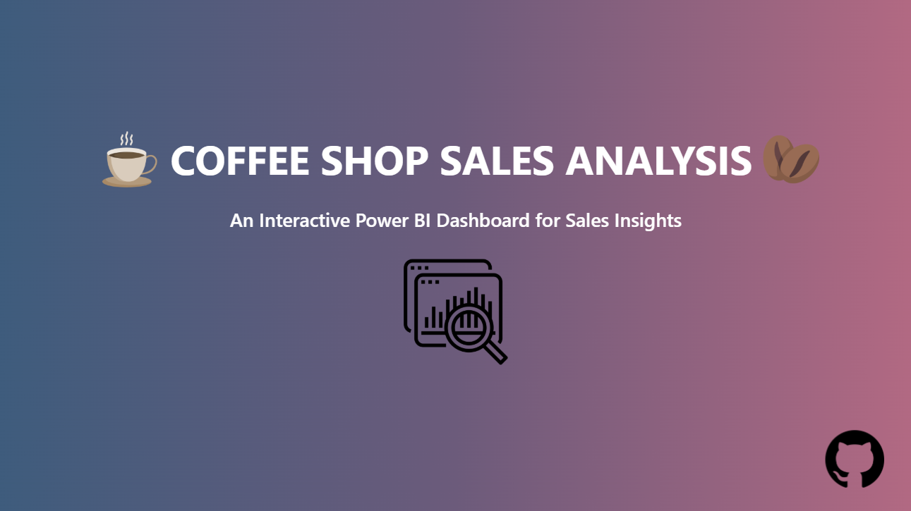
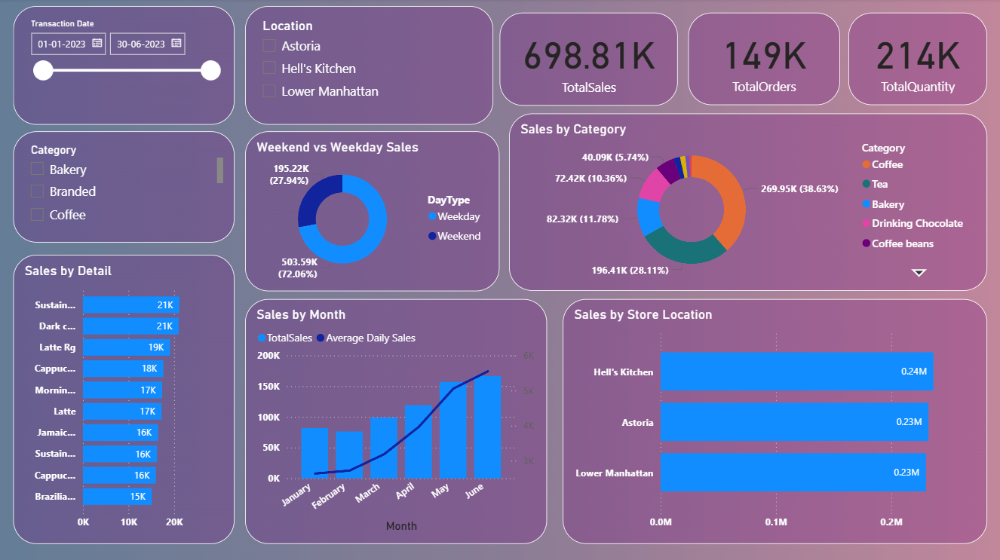

#  Coffee Shop Sales Dashboard

An **interactive Power BI dashboard** built using **SQL + Power BI**, designed to analyze coffee shop sales and uncover actionable business insights.  
This project demonstrates **data modeling, DAX measures, and visualization design** for clear storytelling.

---

##  Project Overview
- **Data Source**: MySQL, exported as CSV for Power BI  
- **Tools Used**: SQL, Power BI, DAX  
- **Key Features**:
  - Total Sales, Orders, and Quantity KPIs (Month-on-Month trend)  
  - Sales Analysis by **Weekdays vs. Weekends**  
  - Sales Analysis by **Store Location**  
  - Daily Sales with **Average Line**  
  - Sales by **Product Category**  
  - **Top 10 Products** by Sales    

---

##  Dashboard Preview

### Cover Page

### Main Dashboard

